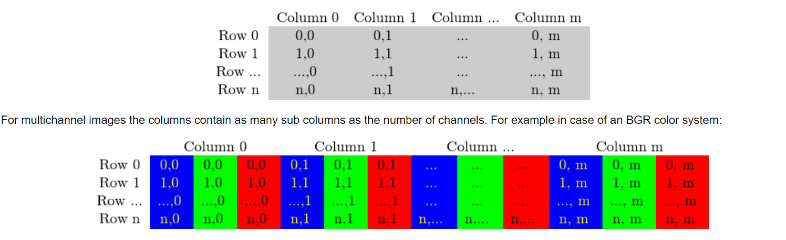

## 图像基本操作

### 读取、写入、输出图像

- 经常需要使用的三个头文件
  - `core` section, as here are defined the basic building blocks of the library
  - `imgcodecs` module, which provides functions for reading and writing
  - `highgui` module, as this contains the functions to show an image in a window

- Read an image from file

  ```c++
  #include <opencv2/core.hpp>
  #include <opencv2/imgcodecs.hpp>
  #include <opencv2/highgui.hpp>
  #include <iostream>
  using namespace cv;
  /*cv::imread(image_path, IMRED_COLOR);
  - IMREAD_COLOR loads the image in the BGR 8-bit format. This is the default that is used here.
  - IMREAD_UNCHANGED loads the image as is (including the alpha channel if present)
  - IMREAD_GRAYSCALE loads the image as an intensity one*/
  ```

- Display an image in an Opencv window

  ```C++
   imshow("Display window", img);
  ```

  读出来的Mat对象可以直接用`imshow`在窗口中去显示

- write an image to a file

  ```c++
  imwrite("starry_night.png", img);
  ```

  用`imwrite`函数可以将Mat对象写入文件

### 遍历、查找表和时间估计

#### 查找表

- 查找表就是预先把所有情况的输入、输出都存放在一个数组里，然后新数据来的时候只需要进行查找即可

#### 时间估计

- 使用Opencv提供的两个函数实现：

  1. getTickCount()：Returns the number of ticks of your systems CPU from a certain event (like since you booted your system)
  2. getTickFrequency()：Returns how many times your CPU emits a tick during a second

  ```c++
  double t = (double)getTickCount();
  // do something ...
  t = ((double)getTickCount() -t)/getTickFrequency();
  cout << "Times passed in seconds: " << t << endl;
  ```

#### 图像在内存中的存储

- 这里注意Opencv使用的是BGR来存放的

  

#### 图像的遍历

- The efficient way

  最快的方式还是使用传统C语言格式的operator`[]`或者说pointer去访问

  ```C++
  Mat& ScanImageAndReduceC(Mat& I, const uchar* const table)
  {
      // accept only char type matrices
      CV_Assert(I.depth() == CV_8U);
      int channels = I.channels();
      int nRows = I.rows;
      int nCols = I.cols * channels;
      if (I.isContinuous())
      {
          nCols *= nRows;
          nRows = 1;
      }
      int i,j;
      uchar* p;
      for( i = 0; i < nRows; ++i)
      {
          p = I.ptr<uchar>(i);
          for ( j = 0; j < nCols; ++j)
          {
              p[j] = table[p[j]];
          }
      }
      return I;
  }
  ```

- The safe way

  ```C++
  Mat& ScanImageAndReduceIterator(Mat& I, const uchar* const table)
  {
      // accept only char type matrices
      CV_Assert(I.depth() == CV_8U);
      const int channels = I.channels();
      switch(channels)
      {
      case 1:
          {
              MatIterator_<uchar> it, end;
              for( it = I.begin<uchar>(), end = I.end<uchar>(); it != end; ++it)
                  *it = table[*it];
              break;
          }
      case 3:
          {
              MatIterator_<Vec3b> it, end;
              for( it = I.begin<Vec3b>(), end = I.end<Vec3b>(); it != end; ++it)
              {
                  (*it)[0] = table[(*it)[0]];
                  (*it)[1] = table[(*it)[1]];
                  (*it)[2] = table[(*it)[2]];
              }
          }
      }
      return I;
  }
  ```

  高效方法需要我们去判断存储是否连续，相对来说比较麻烦，这里使用的迭代器方法则帮助完成了上面的监测操作

- 实时地址计算与引用返回

  ```C++
  Mat& ScanImageAndReduceRandomAccess(Mat& I, const uchar* const table)
  {
      // accept only char type matrices
      CV_Assert(I.depth() == CV_8U);
      const int channels = I.channels();
      switch(channels)
      {
      case 1:
          {
              for( int i = 0; i < I.rows; ++i)
                  for( int j = 0; j < I.cols; ++j )
                      I.at<uchar>(i,j) = table[I.at<uchar>(i,j)];
              break;
          }
      case 3:
          {
           Mat_<Vec3b> _I = I;
           for( int i = 0; i < I.rows; ++i)
              for( int j = 0; j < I.cols; ++j )
                 {
                     _I(i,j)[0] = table[_I(i,j)[0]];
                     _I(i,j)[1] = table[_I(i,j)[1]];
                     _I(i,j)[2] = table[_I(i,j)[2]];
              }
           I = _I;
           break;
          }
      }
      return I;
  }
  ```

  这种方法需要cv::Mat::at()方法实时计算地址，所以是最低效的访问方法(实际上就是`I[i][j]`的访问方法)

## Mat类解析

- Mat类包含两个部分

  1. matrix header(containing information such as the size of the matrix, the method used for storing, at which address is the matrix stored, and so on)
     - matrix size is constant
  2. a pointer to the matrix containing the pixel value
     - 系统会自动为真正的pixel value矩阵分配存储空间，但是Mat本身并不一定会跟真实数据放在一起
     
- Mat的属性及理解

  1. flags：多种属性编码成的一个32bits值，包括存储是否连续、数据类型、channels等等
  2. data：是一个指针，指向数据真正存放的地址
  3. datastart、dataend：是一个指针，指向的是当前数据的启示地址、结束地址，注意和上面的data不同，比如在对图像进行取ROI的时候，他们的data是一样的，都用的是同一块数据，但是他们靠datastart和dataend来区分
  4. size：是一个结构体指针，指向一个说明图像数据属性的结构体
  

- Mat类使用reference counting system 解决图像数据拷贝的问题

  1. 每一个Mat对象都有自己的matrix header和一个pointer

     ```c++
     Mat A, C;                          // creates just the header parts
     A = imread(argv[1], IMREAD_COLOR); // here we'll know the method used (allocate matrix)
     Mat B(A);                                 // Use the copy constructor
     C = A;                                    // Assignment operator
     ```

     所有上面的操作都会使用同一个pixel value matrix而不是开辟一块新空间去存放，所以对pixel value的改变会影响所有的对象。拷贝的实际上是header和pointer而不是真实pixel value

  2. 最后一个使用piexel matrix的对象负责清除这块空间。

     这里用到的是reference counting system，当有一个新对象指向pixel value的时候，counter自增，清除一个对象的时候，counter自减

  3. 想使用副本的时候，可以用cv::Mat::clone()和cv::Mat::copyTo()两个函数

     ```C++
     Mat F = A.clone();
     Mat G;
     A.copyTo(G);
     ```

- 显示创建Mat类

  1. 使用cv::Mat::Mat()构造函数

     ```C++
     Mat M(2,2, CV_8UC3, Scalar(0,0,255));
     cout << "M = " << endl << " " << M << endl << endl;
     ```

     - 二维的**Mat**可以直接用**<<**输出

     - 需要指定数据类型和存储值，以及通道数，命名规则如下：

       ```C++
       CV_[The number of bits per item][Signed or Unsigned][Type Prefix]C[The channel number]
       ```

  2. 小矩阵，使用comma seperated initializers lists

     ```C++
     Mat C = (Mat_<double>(3,3) << 0, -1, 0, -1, 5, -1, 0, -1, 0);
     cout << "C = " << endl << " " << C << endl << endl;
     ```

- 输出格式

  - Python: format(R, Formatter::FMT_PYTHON)

  - Numpy: format(R, Formatter::FMT_NUMPY)

  - Opencv提供其他形式的data structure，可以通过<<符号输出

    1. 2D pint

       ```C++
       Point2f P(5, 1);
       cout << "Point (2D) = " << P << endl << endl;
       ```

    2. 3D point

       ```C++
       Point3f P3f(2, 6, 7);
       cout << "Point (3D) = " << P3f << endl << endl;
       ```

    3. std::vector via::Mat

       ```C++
       vector<float> v;
       v.push_back( (float)CV_PI);   v.push_back(2);    
       v.push_back(3.01f);
       cout << "Vector of floats via Mat = " << Mat(v) << endl << endl;
       ```

    4. std::vecotr of points

       ```C++
       vector<Point2f> vPoints(20);
       for (size_t i = 0; i < vPoints.size(); ++i)
       	vPoints[i] = Point2f((float)(i * 5), (float)(i % 7));
       cout << "A vector of 2D Points = " << vPoints << endl << endl;
       ```

## 杂项待归类

### DMatch理解
  1. queryIdx：匹配点1在查询图中的索引
  2. trainIdx：匹配点2在训练图中的索引
  3. imgIdx：图像索引
  4. distance：匹配点1、2之间的距离
  
### DescriptorMatcher::match理解
  函数原型：
  
  ```c++
  void cv::DescriptorMatcher::match(
        InputArray queryDescriptors, 
        InputArray  	trainDescriptors,
        std::vector< DMatch > &  	matches,
		    InputArray  	mask = noArray() 
	) 		const
  ```
  
  在使用的时候需要先创建一个vector<DMatch>的matches

## C++便捷操作

### 字符串处理

#### 传入参数处理

- 当参数通过命令行传入主函数的时候，可以将对应位置的字符串参数变成指定的类型，使用定向符号即可：

  ```C++
  int divideWith = 0; // convert our input string to number - C++ style
  stringstream s;
  s << argv[2];
  s >> divideWith;
  ```

  

